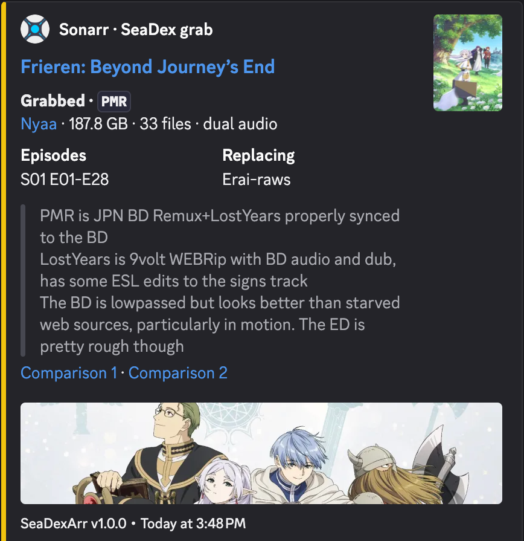

# SeaDexArr

[](https://pypi.org/pypi/seadexarr/)
[](https://pypi.org/pypi/seadexarr/)
[](https://github.com/bbtufty/seadexarr/actions)
[](LICENSE)



SeaDexArr is designed as a tool to ensure that you have Anime releases on the Arr apps that match with the best 
releases tagged on SeaDex. SeaDexArr supports both Sonarr and Radarr.

For Sonarr, it works by scanning through series, matching these up via the TVDB or IMDb IDs to AniList IDs 
and ultimately finding releases in the SeaDex database. The primary mapping source is PlexAniBridge-Mappings 
(https://github.com/eliasbenb/PlexAniBridge-Mappings), with the Kometa Anime Mappings 
(https://github.com/Kometa-Team/Anime-IDs) and AniDB mappings (https://github.com/Anime-Lists/anime-lists) 
as fallbacks for anything it misses. For Radarr, this works much the same but instead using the TMDB and 
IMDb IDs.

SeaDexArr will then do some cuts to select a "best" release, which can be pushed to Discord via a webhook, and added
automatically to a torrent client. This should make it significantly more hands-free to keep the best Anime releases 
out there.

There are then two options for how SeaDexArr will filter releases to grab:

Against existing files (default; `seadex.use_torrent_hash_to_filter: false`):

SeaDexArr will attempt to match these releases to release groups in Sonarr/Radarr, and for Sonarr will also try to
parse filenames to check against individual episodes. SeaDexArr also checks against filesizes, to attempt to catch when 
release groups put out updated releases, or those at higher quality.

Against torrent hashes (`seadex.use_torrent_hash_to_filter: true`):

SeaDexArr will match releases to torrent hashes in the cache. This will ensure that if releases get updated then they
will be grabbed. However, if you already have an existing library then this could result in torrents being downloaded
again, and will grab multiple overlapping results if you aren't in interactive mode. This mode is also blind to what
the Arr actually has on disk: it only consults the hashes SeaDexArr itself grabbed, so releases obtained out-of-band
(e.g. a private release grabbed directly from its tracker) are invisible to it, and the owned-file protections of the
default mode don't apply.

By default, SeaDexArr will not check a particular release again unless SeaDex has updated recently. You can override
this behaviour by setting ``seadex.ignore_seadex_update_times`` to true in the config (see config section below).

> [!TIP]
> **If you make changes to your config, you should probably remove your cache. You can do so by CLI,
> use ``seadexarr cache remove`` (see below for more details).**

## Installation

SeaDexArr is available as a Docker container. Into a Docker Compose file:

```
services:

  seadexarr:
    image: ghcr.io/bbtufty/seadexarr:latest  # or seadexarr:main for the cutting edge
    container_name: seadexarr
    environment: 
      - SCHEDULE_TIME=6  # Deprecated: set schedule.interval_hours in config.yml instead (env still wins if set)
    volumes:
      - /path/to/config:/config
    restart: unless-stopped
```

And then to run on a schedule, simply run `docker compose up -d seadexarr`. If you want to run one Arr one time, you 
can instead run like `docker compose run seadexarr run single --sonarr`.

SeaDexArr can also be installed via pip:

```
pip install seadexarr
```

Or the cutting edge via GitHub:

```
git clone https://github.com/bbtufty/seadexarr.git
cd seadexarr
pip install -e .
```

## Data directory

SeaDexArr keeps everything — `config.yml`, the caches (`cache.db`, `mappings.db`) and
`logs/` — in a single data directory. By default this is the OS-standard per-user
location:

| OS      | Default data directory                          |
|---------|-------------------------------------------------|
| Linux   | `~/.local/share/seadexarr` (honors `$XDG_DATA_HOME`) |
| macOS   | `~/Library/Application Support/seadexarr`        |
| Windows | `%LOCALAPPDATA%\seadexarr`                       |

Override the location with the `SEADEX_ARR_DATA_DIR` environment variable or the global
`--data-dir` flag (the flag wins). Run `seadexarr paths` to print the resolved locations.
The Docker image sets `SEADEX_ARR_DATA_DIR=/config`, so the `/config` volume mount above
holds the whole data directory.

## CLI

SeaDexArr features a command-line interface, with a number of modules. If running in Docker mode, 
run them through your compose service, e.g. ``docker compose run seadexarr cache stats``
(everything after the service name is passed to the ``seadexarr`` CLI).

### ``seadexarr run``

There are two options here, ``run scheduled`` and ``run single``. Scheduled is the default mode,
and will run if you just enter ``seadexarr`` into the command line, which will run every few hours
(default 6) to keep things up to date automatically. Single will just run once and be done. For
the single run, pass --sonarr or --radarr to run the Sonarr or Radarr modules. Scheduled runs
automatically for both

To run for just a single title, pass ``--movie-id`` with a movie's TMDB ID (runs Radarr) or
``--series-id`` with a series' TVDB ID (runs Sonarr), e.g. ``run single --movie-id 12345`` or
``run single --series-id 67890``. Either flag on its own implies a run of the matching module,
so you don't also need ``--radarr``/``--sonarr``.

``run single`` also accepts ``--dry-run``, which simulates the run without grabbing torrents,
writing the cache, or sending notifications, and ``--import-wait-mode``, which overrides the
configured ``imports.wait_mode`` (off/deferred/blocking/hybrid) for that run (see
"Waiting for imports" below).

### ``seadexarr config``

To generate a blank config file, simply enter ``config init``. You can then populate
to your liking. The file is written to the data directory (see above); run
``seadexarr paths`` to find it. An existing ``config.yml`` is never overwritten
unless you pass ``--force``.

### ``seadexarr paths``

Prints the resolved data directory and the files within it (config, caches, logs).
Useful for confirming where SeaDexArr is reading/writing, especially with a custom
``--data-dir`` or ``SEADEX_ARR_DATA_DIR``.

### ``seadexarr cache``

There are five cache commands:

- ``cache backup``: back up ``cache.db`` to ``cache.backup.db``, using the SQLite online-backup API
  so the snapshot is consistent even mid-write
- ``cache restore``: replace ``cache.db`` with a copy of ``cache.backup.db`` (the backup is
  kept, so a restore is repeatable; stale WAL/SHM sidecar files are cleared first)
- ``cache remove``: delete ``cache.db`` and its WAL/SHM sidecar files. Useful if you've changed
  the config and want to do a fresh run
- ``cache stats``: print cache health (per-block row counts and on-disk size)
- ``cache check``: run a SQLite integrity check on the cache database

## Scripting

The CLI is the primary interface — a one-off run is just ``seadexarr run single --sonarr --radarr``.
Commands exit non-zero when they fail (a failed run, backup, or refused restore), so they compose
with ``&&``, cron, and health checks.
The same composition is available programmatically: build the shared collaborators with
``RunDeps.build``, wrap them in a ``RunServices`` hub, inject both into the ``RunLoop``
plus an Arr strategy, and drive ``run_sync``:

```python
from seadexarr import RunDeps, RunLoop, RunServices, SonarrSync
from seadexarr.modules.config import AppConfig, Arr
from seadexarr.modules.mappings import MappingResolver
from seadexarr.modules.paths import ensure_data_dir, resolve_paths

paths = resolve_paths()
ensure_data_dir(paths)
config = AppConfig.load(paths.config)

# Downloads/parses the ID-mapping sources once; shared across Arr runs.
mappings = MappingResolver(
    cache_time=config.advanced.cache_time,
    ignore_anilist_ids=config.seadex.ignore_anilist_ids,
    anime_mappings_cfg=config.mappings.anime_mappings,
    anidb_mappings_cfg=config.mappings.anidb_mappings,
    anibridge_mappings_cfg=config.mappings.anibridge_mappings,
    mappings_db=paths.mappings_db,
)
try:
    deps = RunDeps.build(
        Arr.SONARR,
        paths.config,
        paths.cache,
        mappings=mappings,
        app_config=config,
    )
    try:
        services = RunServices(deps, Arr.SONARR)
        runner = RunLoop(deps, services)
        runner.run_sync(
            SonarrSync(deps, services),
            item_id=None,
            dry_run=False,
        )
    finally:
        deps.close()
finally:
    mappings.close()
```

A Radarr run is the same shape with ``RadarrSync`` and ``Arr.RADARR``. If no config file exists
yet, ``AppConfig.load`` writes the starter template to the data directory (run ``seadexarr paths``
to find it) and raises ``FileNotFoundError``; populate it to your own preference and run again.

## How SeaDexArr chooses a release

SeaDexArr performs a number of cuts to get to a single best release for you. 
First, it will filter out all torrents that have any tags as defined in ``seadex.ignore_tags``.
Then, it will filter out all torrents coming from trackers that haven't been specified (if you haven't been more 
granular, this will be all public trackers and potentially all private trackers; see ``seadex.trackers``). 
SeaDexArr never grabs private releases (SeaDex carries no downloadable link for them), so anything from a private 
tracker is filtered out; ``seadex.private_releases`` sets the policy for titles only available privately. 
Next, if you only want to grab releases marked by SeaDex as "best" (``seadex.want_best``), it will down-select any 
torrents marked as "best", as long as there's at least one. 
Finally, if you want dual audio (``seadex.prefer_dual_audio``), it will down-select any dual-audio torrents, as long 
as there's at least one. If this is instead set to ``false``, it will do the opposite, filtering out any dual-audio 
torrents (so long as there's at least one not tagged as dual-audio). 
If the release this lands on is only available on private trackers you won't grab from, SeaDexArr by default 
(``seadex.private_releases: warn``) warns and re-checks the title every run until a public release appears; set 
``seadex.private_releases: fallback`` to instead grab the entry's best public alternative. 
A fallback never replaces a copy of the preferred private release you already own: if the Arr holds it at a stale 
size (SeaDex's record changed, e.g. the group patched it), the title warns and holds instead of grabbing the 
substitute — update the release from its private tracker, or delete the stale files to let the fallback stand in. 
A preferred public release (equal rank) still supersedes as usual. 
By doing this, SeaDexArr should generally find a single best
torrent, though if you're in interactive mode (``advanced.interactive``) and there are multiple options that match
your criteria, it will give you an option to select one (or multiple).

## Waiting for imports

SeaDexArr can optionally wait for grabbed torrents to finish downloading and then shepherd them
into Sonarr (Sonarr only; on Radarr runs this is a no-op). After a torrent is added, SeaDexArr
waits for qBittorrent to finish it, then asks Sonarr to rescan and watches its queue: it lets
Sonarr import the files itself, and only steps in with a series-pinned manual import (using
SeaDexArr's own authoritative episode mapping) when Sonarr can't auto-import them or isn't
tracking the download.

The feature is controlled by ``imports.wait_mode``:

- ``off``: disabled (default) — no waiting, no pending records, no manual import
- ``deferred``: never block; import already-complete downloads on a later run
- ``blocking``: block at the end of the run until downloads complete, then import
- ``hybrid``: recommended — a deferred reconcile at the start of the run plus a blocking pass at
  the end

The remaining ``imports.*`` keys (timeouts, poll cadence, import mode, languages) are described in
the config section below. To get a push notification when a wait pass finishes, set
``notifications.wait_notify`` — it defaults to on whenever a Discord or generic webhook is
configured (see ``notifications.wait_webhook_url``).

## Config

The config file is nested YAML: settings live in eight groups (``sonarr``, ``radarr``,
``qbittorrent``, ``seadex``, ``imports``, ``notifications``, ``mappings``, ``advanced``), referred
to as ``group.key`` below. The config is validated on load — an unknown or misspelled key fails
with an error naming it rather than being silently ignored — and keys left blank fall back to
their defaults. These should be self-explanatory, but a more detailed description of each is given
below.

### Sonarr/Radarr settings

- `sonarr.url`: URL for Sonarr. Required when running the Sonarr module
- `sonarr.api_key`: API key for Sonarr (Settings/General/API Key). Required when running the Sonarr module
- `sonarr.ignore_unmonitored`: If true, will skip series unmonitored in Sonarr. Defaults to false
- `sonarr.torrent_category`: Sonarr torrent import category, if you have one. Defaults to blank, which won't
  set a category
- `sonarr.ignore_movies_in_radarr`: If true, will not add releases found in Sonarr (movie specials) if they already
  exist as movies in Radarr. Defaults to false

The `radarr` group takes the same keys (minus `ignore_movies_in_radarr`): `radarr.url`,
`radarr.api_key`, `radarr.ignore_unmonitored`, and `radarr.torrent_category`.

### qBittorrent settings

- `qbittorrent.host`/`qbittorrent.username`/`qbittorrent.password`: Details for qBittorrent. All three are
  needed to add torrents; leave any blank and SeaDexArr runs in preview mode (nothing is grabbed)
- `qbittorrent.tags`: Tags to add to the torrent when added to the client. Defaults to blank, which won't
  add any tags
- `qbittorrent.options`: Extra keyword arguments for the qBittorrent client, e.g.
  `{VERIFY_WEBUI_CERTIFICATE: false}` for a self-signed WebUI. Defaults to empty

### SeaDex filters

- `seadex.private_releases`: What to do when the preferred release is only available on private trackers.
  Private releases are never grabbed (SeaDex carries no downloadable link for them). `warn` (the default) warns
  and leaves the title uncached, so it's re-checked every run until a public release appears. `fallback` instead
  grabs the entry's best public alternative (the same best/dual-audio preferences applied to the public torrents
  only), warning only when it can't find a public alternative for those files, or when you already own the
  preferred private release at a stale size (a fallback never replaces an owned copy). Titles satisfied by a
  fallback are remembered; switching back to `warn` re-checks them and resurfaces the private-only warning
- `seadex.prefer_dual_audio`: Prefer results tagged as dual audio, if any exist. If false, will instead prefer
  Ja-only releases. Defaults to true
- `seadex.want_best`: Prefer results tagged as best, if any exist. Defaults to true
- `seadex.ignore_tags`: Can filter out based on SeaDex tags. Some examples:
  - Dolby Vision
  - Misplaced Special
  - Deband Required
- `seadex.trackers`: Can manually select a list of trackers. Defaults to blank, which will use all the 
  public and private trackers regardless of `seadex.private_releases` — private filtering happens later in
  the selection, so the `warn`/`fallback` policies can still see (and report on) private-only releases.
  All trackers with torrents on SeaDex, and whether they are supported are below.
  - Public trackers
    - Nyaa (supported)
    - AnimeTosho (supported)
    - AniDex
    - RuTracker (supported)
  - Private trackers
    - AB
    - BeyondHD
    - PassThePopcorn
    - BroadcastTheNet
    - HDBits
    - Blutopia
    - Aither
- `seadex.ignore_anilist_ids`: AniList IDs to never process (a list of integer IDs). Defaults to empty
- `seadex.ignore_seadex_update_times`: If true, will not check against the update times in the cache to
  decide whether to search for a release. Defaults to false
- `seadex.use_torrent_hash_to_filter`: Can either try and filter by release groups in Sonarr/Radarr (false),
  or by torrent hashes in the cache (true). Defaults to false. See a more detailed description above

### Import settings

These control the wait-for-completion and Sonarr manual-import feature (see "Waiting for imports"
above; Sonarr only).

- `imports.wait_mode`: `off` (disabled), `deferred`, `blocking`, or `hybrid`. Defaults to off
- `imports.wait_timeout`: Seconds to wait per torrent for qBittorrent to finish. Defaults to 3600
- `imports.ready_timeout`: Seconds to then wait for Sonarr to rescan and import. Defaults to 600
- `imports.poll_interval`: Seconds between polls of qBittorrent and the Sonarr queue. Defaults to 30
- `imports.progress_poll_interval`: Seconds between cheap re-reads for the wait screen's
  files-imported bar and live download telemetry. 0 disables it, and values at or above
  `imports.poll_interval` behave the same. Defaults to 5
- `imports.mode`: Sonarr import mode: `auto`, `move`, or `copy`. Defaults to auto
- `imports.post_import_category`: qBittorrent category to move a torrent to once its import is
  verified complete (e.g. to hand finished torrents different seeding rules). The category is
  created if it doesn't exist. The move happens when seadexarr verifies the import, so it needs a
  non-off wait mode. Note that with qBittorrent's Automatic Torrent Management enabled, changing
  category can relocate the torrent's data to the new category's save path. Defaults to blank,
  which leaves the add-time category in place
- `imports.default_quality`: Fallback quality name (e.g. Bluray-2160p) for manual imports, useful on
  a 4K instance. Defaults to blank
- `imports.languages_dual`: Languages applied to imported dual-audio releases. Defaults to
  [Japanese, English]
- `imports.languages_single`: Languages applied to imported single-audio releases. Defaults to [Japanese]
- `imports.pending_max_age_days`: Drop pending-import records older than this many days. Defaults to 14
- `imports.digest_interval`: Target seconds between wait-progress digests on a non-TTY (Docker/cron).
  Defaults to 300

### Notification settings

- `notifications.discord_url`: If you want to use Discord notifications (recommended), then set up a webhook
  following [this guide](https://support.discord.com/hc/en-us/articles/228383668-Intro-to-Webhooks) and add the URL
  here. Defaults to blank, which won't use the Discord integration
- `notifications.wait_webhook_url`: Generic outbound webhook (ntfy/gotify/Home Assistant) for the wait
  summary. Defaults to blank
- `notifications.wait_notify`: Push a notification when a wait pass completes. Defaults to on whenever
  either webhook above is set

### Mapping settings

- `mappings.anime_mappings`: Can provide custom Anime ID mappings here. Otherwise, will use the Kometa mappings.
  Set to false to disable Anime ID mappings entirely. The general user should not set this. Defaults to blank
- `mappings.anidb_mappings`: Set to false to disable AniDB mappings entirely. Otherwise, will use the AniDB
  mappings (used for specials). The general user should not set this. Defaults to blank
- `mappings.anibridge_mappings`: Can provide custom AniBridge mappings here. Otherwise, will use the
  PlexAniBridge mappings (the primary mapping source). Set to false to disable AniBridge mappings entirely.
  The general user should not set this. Defaults to blank

### Advanced settings

- `advanced.sleep_time`: To avoid hitting API rate limits, after each query SeaDexArr will wait a number 
  of seconds. Defaults to 2
- `advanced.cache_time`: The mappings files don't change all the time, so are cached for a certain number
  of days. Defaults to 1
- `advanced.interactive`: If true, will enable interactive mode, which when multiple torrent options are
  found, will ask for input to choose one. Otherwise, will just grab everything. Defaults to false
- `advanced.max_torrents_to_add`: Used to limit the number of torrents you add in one run. Defaults to blank,
  which will just add everything it finds
- `advanced.log_level`: Controls the level of logging. Can be DEBUG, INFO, WARNING, ERROR, or CRITICAL. Defaults to "INFO"

## Roadmap

- Support for other mappings between TVDB/TMDB/IMDb and AniList IDs
- Support for other torrent clients
- Support for more torrent sites
