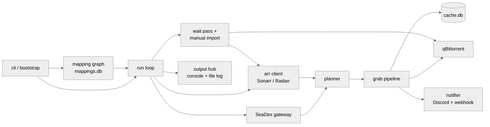

# Architecture

This page explains how Pearlarr is put together.
It covers the run lifecycle, the subsystems, the decisions behind the complex ones, and the invariants the code enforces.

## The run, end to end

A run is one sweep over every configured arr: a single `pearlarr run single`, or one cycle of the scheduled loop.
`cli.py` is the command surface. It resolves the data directory, installs the output hub, and hands off to `bootstrap.run_arrs`, the composition root, which reads and validates the config once, refreshes the ID-mapping sources, and runs each configured arr in turn through its Sonarr/Radarr strategy (`SonarrSync`/`RadarrSync`).

For one arr:

1. builds the runtime dependencies (`RunDeps`): the arr client, the shared HTTP clients, qBittorrent (or preview mode when credentials are absent), the SQLite cache;
2. scans the arr's library and resolves each series/movie to an AniList ID through the mapping graph;
3. for each ID with a SeaDex entry that changed since it was last handled: selects the releases to grab (the planner), skips what the arr already owns, and adds the survivors to qBittorrent (the grab pipeline);
4. notifies (Discord embed per grab), records the decisions in the cache, and prints the run summary;
5. on Sonarr, optionally runs the wait pass (`imports.wait_mode`): wait for downloads to finish, let Sonarr import them, and step in with a manual import where Sonarr cannot.

Scheduled mode wraps that in a loop: one cycle runs every configured arr, then sleeps `schedule.interval_hours`; the config is re-read each cycle.

## Module map

| Subsystem | Modules | Role |
| --- | --- | --- |
| Composition | `cli`, `bootstrap`, `run_loop`, `run_services`, `seadex_sonarr`, `seadex_radarr` | CLI commands, dependency wiring, the per-arr run loop and its Sonarr/Radarr strategies, the per-ID service hub |
| Configuration | `config`, `paths`, `env_registry` | validated settings, the data directory, env inventory |
| Mapping graph | `mappings`, `mapping_store`, `anibridge`, `anilist_client`, `anilist_gateway` | AniList/TVDB/TMDB/IMDb ID resolution and per-season episode maps, parsed once into `mappings.db` |
| Selection | `seadex_gateway`, `seadex_filter`, `planner`, `coverage` | fetch SeaDex entries, filter releases, decide what to grab |
| Grabbing | `grab_pipeline`, `torrents` | tracker page parsing, qBittorrent adds, per-release outcomes |
| Import wait | `manual_import`, `sonarr_import`, `sonarr_import_plan`, `import_wait`, `wait_view` | waiting on downloads, Sonarr queue classification, the series-pinned manual import |
| State | `cache` | the SQLite decision cache, staged writes, backup/restore |
| Output | `output/*`, `log`, `console_caps`, `boot_flow` | the event hub, renderers, the always-on file log |
| Notifications | `notify`, `discord` | Discord embeds, the generic wait webhook |
| Reporting | `reporter` | run summary and needs-action rows |

## Design notes

Compact records of the load-bearing decisions: what was decided, why, and what was rejected.
Notes are appended, not rewritten, so the reasoning trail survives.

### Planner: flag mutation over same-files groups

The planner mutates download flags on the SeaDex release dictionary in place, resolving conflicts per *same-files group* (release groups covering identical files).
Private-only sets are resolved by promotion: when the arr's copy is stale (a size mismatch shows an upgrade is pending), the best public alternative covering the same files is promoted; when the arr genuinely owns the files, nothing is grabbed; when only a fallback could replace an *owned* copy of the preferred private release, the title holds and warns instead: re-downloading owned content is never correct.
Dropped groups re-flag any public URL whose episode coverage no survivor carries (group-atomic drops must not lose episodes).
A full per-URL planner redesign was prototyped and rejected: it re-derives the same same-files groups with more state and no behavioral win.

### Output: an event hub, not a logger

All run output flows as typed events through a process-global hub with per-scope handles; renderers (rich cockpit, plain console, JSON) subscribe, and a structured file log is always on.
Raw `logging.*` calls are banned (lint + an AST canary test); the one sanctioned raw site is the crash handler in `log.py`.
Why: renderer failures are contained (a broken progress view cannot kill a run), the file grammar stays byte-stable, and tests assert on recorded events instead of scraping strings.
Rejected alternatives, after a five-proposal design debate: pure logging with formatters (loses lifecycle/reflow control), a document model (over-general), scoped emitters without a hub (no single containment point).

### Cache: SQLite with staged writes and a preview gate

Decisions persist in `cache.db` behind a `CacheStore` with one commit chokepoint: writes stage in a transaction and `save(preview=...)` commits only for real runs. Preview mode discards everything.
A fresh store starts in memory and is promoted to disk via the SQLite backup API plus an atomic rename, so a half-written `cache.db` cannot exist.
Reads fail open (a corrupt cache re-evaluates titles instead of aborting), and a file lock keeps concurrent runs from interleaving.
The predecessor `cache.json` was rejected for having no atomicity, no partial-failure story, and no queryable schema.

### Manual import: our mapping is authoritative

The wait pass treats Sonarr's *episode files and queue* as ground truth for what landed, but never trusts Sonarr's candidate parse for what a file *is*: the AniList-derived episode mapping assigns files to episodes (`ordered_episode_ids`), because SeaDex releases routinely carry specials and orderings Sonarr misparses.
Sonarr is always given the chance to import first; the manual import only steps in for blocked or untracked downloads, and a clean `importPending` row always waits (see the invariants below).
Rejected: reusing Sonarr's manual-import candidates as the mapping source, the exact misparse the feature exists to correct.

## Glossary

| Term | Meaning |
| --- | --- |
| entry | A SeaDex entry for one AniList ID. |
| release / release group | A torrent listed on an entry / the group that made it. |
| grab | Adding a torrent to qBittorrent. |
| import | The arr (or Pearlarr's manual import) moving finished files into the library. |
| run | One sweep over every configured arr: a single `pearlarr run single`, or one scheduled cycle. |
| cycle | One scheduled-loop iteration (every configured arr, once). |
| wait pass | The post-grab phase that waits for downloads and drives imports. |
| preview mode | qBittorrent credentials absent: everything is evaluated and reported, nothing is grabbed or cached. |
| the arrs / an arr | Sonarr and Radarr, collectively/generically. |
| dual-audio | A release carrying both Japanese and English audio. |

## External hosts

Every host Pearlarr talks to, and why:

| Host | Purpose |
| --- | --- |
| `releases.moe` (SeaDex) | Entry lookups: which releases are tagged for each AniList ID. |
| `graphql.anilist.co` | AniList titles. |
| `github.com` -> `objects.githubusercontent.com` | The primary ID-mapping source (`anibridge-mappings`, a GitHub release asset that 302-redirects to the asset CDN). |
| `raw.githubusercontent.com` | The two fallback ID-mapping sources (Kometa `Anime-IDs`, anime-lists XML). |
| Your Sonarr / Radarr | Library, history, parse, and import APIs. |
| Your qBittorrent WebUI | Adding and monitoring torrents. |
| Tracker sites (Nyaa, AnimeTosho, RuTracker) | Resolving a release's actual torrent download. |
| `discord.com` / your webhook host | The notifications you configure. |

API citizenship: `advanced.sleep_time` paces successive API queries (off by default; set a positive value to throttle); mapping sources are cached for `advanced.cache_time` days; SeaDex entries are re-checked only when SeaDex updated them.
Scheduling below one hour buys nothing, since SeaDex and the mapping sources change slowly.

No telemetry: Pearlarr is outbound-only, listens on no ports, and sends nothing anywhere except the services above.

## Invariants

Load-bearing invariants, indexed from their `# Invariant:` enforcement-site comments in the source. Each entry names the module that enforces it.

<!-- gen:invariants - GENERATED by scripts/gen_docs.py from the # Invariant: comments in pearlarr/; do not edit between the markers; regenerate: uv run python scripts/gen_docs.py -->
- `pearlarr/cache.py` - a preview run never commits - every staged write is discarded on close, so preview mode can never mark a title as handled.
- `pearlarr/grab_pipeline.py` - a tracker without a registered parser never reaches TorrentService.add - this skip+warn is the enforcement; the service's raise is a defensive contract. Handing one through would unwind the id's whole url loop (dropping later grabbable releases too); the title is flagged so it's not cached as done (re-checked once a parser lands).
- `pearlarr/mappings.py` - an empty tvdb_mappings dict is still ANIBRIDGE - a truthiness check would fall back to Anime-IDs season heuristics and over-grab.
- `pearlarr/planner.py` - a fallback substitute never replaces an owned copy of the preferred private release - those sets hold and warn every run.
- `pearlarr/seadex_sonarr.py` - this dedup names Arr.RADARR explicitly while running Sonarr - folding the arr param into the run's bound arr breaks the cross-arr read.
- `pearlarr/sonarr_import_plan.py` - every importPending queue row buckets as wait, never STEP_IN - stepping in races Sonarr's own import and double-imports the files.
- `pearlarr/sonarr_import_plan.py` - the import payload always carries a quality key - omitting it crashes Sonarr in FileNameBuilder.AddQualityTokens (observed on Sonarr 4.x).
<!-- /gen:invariants -->
